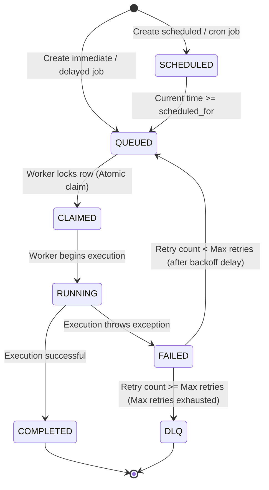

# FlowForge AI — Project Requirements & System Analysis

This document outlines the detailed requirements, specifications, and scope for **FlowForge AI**, a production-inspired intelligent distributed job scheduling and reliability platform.

---

## 1. Problem Statement
Modern distributed applications rely heavily on background workers for asynchronous tasks (e.g., email notification campaigns, data ingestion pipelines, report generation). Standard message-broker schedulers (like Celery with Redis/RabbitMQ) introduce several operational challenges:
- **Broker Complexity**: Managing external message queues introduces extra infrastructure, clustering overhead, and serialization complexities.
- **Transactional Gaps**: Queuing a job and committing a database transaction are separate operations. If the transaction rolls back but the job is already queued, the worker fails due to missing data (dual-write problem).
- **Lack of Multi-Tenancy**: Standard queues do not natively partition jobs by projects or organizations without deploying multiple broker virtual hosts.
- **Poor Concurrency & Queue Control**: Pausing individual queues or limiting concurrency per queue dynamically often requires complex scripting.
- **Debugging & Failure Diagnostics**: Diagnosing failing jobs is manual, requiring developers to inspect raw stack traces and logs.

**FlowForge AI** solves these issues by providing a **SQL-backed distributed scheduler** implemented in Python (using FastAPI, SQLAlchemy, and PostgreSQL). It ensures strict transaction boundary control, multi-tenant separation, granular queue priority and concurrency controls, worker heartbeats for automatic recovery, and built-in **AI-powered job failure analysis** to suggest remediations.

---

## 2. Target Users
- **Backend Software Engineers**: Who need a reliable, transaction-safe background job scheduling mechanism inside a relational database context.
- **System Architects**: Seeking a simplified infrastructure stack (avoiding extra Redis/RabbitMQ dependencies) with high reliability and visibility.
- **DevOps / Site Reliability Engineers (SREs)**: Requiring deep observability into worker health, queue bottlenecks, error rates, and automatic recovery.
- **Technical Support / Operators**: Using the web dashboard to inspect job execution history, trigger manual retries, and read AI failure diagnostics.

---

## 3. Real-world Use Cases
- **E-commerce Order Processing**: Creating delayed jobs for cart abandonment emails, immediate jobs for payment gateway communication, and scheduled jobs for daily inventory reconciliation.
- **Marketing Notifications**: Sending large batches of personalized emails or push notifications, where batch progress tracking and rate-limiting are required.
- **Data Synchronization & Ingestion**: Periodically fetching third-party API data (using cron-like recurring jobs) and processing records.
- **Report Generation**: Generating complex PDF/Excel reports in background worker threads, storing the logs, and updating the database status.
- **AI Task Pipelines**: Running batch inference or long-running machine learning evaluation tasks where jobs might fail and require structured retry strategies and error analysis.

---

## 4. Functional Requirements
- **Authentication**: Safe user registration and login. Token-based session management.
- **Multi-Tenant Hierarchy**: Organizations containing Projects. All queues, workers, and jobs must belong to a specific Project.
- **Granular Queue Management**: Dynamic queue registration, priority adjustments, concurrency limits, and pausing/resuming queues.
- **Job Scheduling & Execution**: Support immediate, delayed, scheduled, recurring (cron), and batch jobs.
- **Distributed Workers**: Multiple concurrently running worker instances polling the database atomically, executing jobs, and sending heartbeats.
- **Job Lifecycle & State Machine**: A well-defined state transitions model preventing duplicate claims or race conditions.
- **Robust Retry & DLQ System**: Auto-retry with configurable backoff policies (fixed, linear, exponential). Automatic redirection to the Dead Letter Queue (DLQ) upon retry exhaustion.
- **Observability & Logging**: Centralized execution logging, worker status registry, system health metrics, and throughput visualization.
- **Web Dashboard**: An interactive, responsive user interface for monitoring and manual operator control.
- **AI Failure Analysis**: Non-blocking diagnostics on failed jobs using a local LLM or free API to summarize exceptions and recommend fixes.

---

## 5. Non-functional Requirements
- **Reliability & Consistency**: At-least-once execution guarantee (no lost jobs due to worker crashes). Atomic operations to prevent duplicate runs (no two workers running the same job).
- **Concurrency Control**: DB-level locking (`SELECT ... FOR UPDATE SKIP LOCKED`) to coordinate distributed workers.
- **Performance**: Poll-latency under 50ms for workers checking for new jobs. Support for hundreds of jobs processed per second on standard PostgreSQL installations.
- **Scalability**: Ability to run multiple worker instances horizontally without central coordinator processes.
- **Security**: Strict authorization check ensuring that users can only view or modify resources in projects they have access to.
- **Ease of Setup**: Zero-dependency local setup using Docker Compose (PostgreSQL + FastAPI backend + React Vite frontend).

---

## 6. Authentication Requirements
- **User Management**: Sign-up and login endpoints with secure password hashing (using `bcrypt`).
- **Session Security**: Token-based authentication using JSON Web Tokens (JWT) with configurable expiration (e.g., 24 hours).
- **Authorization**: Role-Based Access Control (RBAC) supporting:
  - **Admin**: Full access to all projects, queues, and configuration in the organization.
  - **Member**: Can view status, queue new jobs, and manually retry jobs within authorized projects.
  - **ReadOnly**: Can view dashboard metrics and logs but cannot modify configurations or execute operations.

---

## 7. Organization/Project Requirements
- **Organizations**: High-level tenant container representing a company or department.
- **Projects**: Sub-compartment within an organization. All jobs, queues, execution logs, and configurations are namespace-isolated by `project_id`.
- **Isolation Guarantee**: Users authenticated to Project A must be prevented from reading, listing, modifying, or scheduling jobs in Project B.

---

## 8. Queue Requirements
Each project can define multiple queues. Queues have the following characteristics:
- **Priority**: Numeric or categorical (e.g., `Critical=10`, `High=5`, `Default=1`, `Low=0`). Workers prioritize claiming jobs from higher-priority queues.
- **Concurrency Limit**: Maximum number of jobs from this queue that can be executing concurrently across all workers. Useful for rate-limiting calls to external APIs.
- **State Control**: Dynamic pause and resume. When paused, workers are blocked from claiming any jobs from that queue, but new jobs can still be queued.
- **Statistics**: Expose real-time counts of jobs categorized by status: `QUEUED`, `RUNNING`, `COMPLETED`, `FAILED`, `DLQ`.

---

## 9. Job Requirements
Each job is a task record containing:
- **Identifier**: Globally unique UUID.
- **Payload**: JSON dictionary containing arguments for the task execution.
- **Target Handler**: Name of the Python function or task class that the worker must run (e.g., `tasks.send_email`).
- **Status**: The current state of the job in the lifecycle.
- **Priority**: Overridable priority at the job level.
- **Retry Policy**: Definition of maximum retry counts and backoff settings.
- **Timestamps**: `created_at`, `scheduled_for`, `claimed_at`, `started_at`, `finished_at`.
- **Idempotency Key**: Optional client-supplied key to prevent duplicate job insertion.

---

## 10. Immediate Jobs
- Designed for tasks that need to run as soon as possible.
- When inserted, `scheduled_for` is set to the current timestamp.
- Available workers fetch and execute the job during their next polling cycle.

---

## 11. Delayed Jobs
- Target tasks scheduled to run after a specific interval (e.g., in 30 minutes).
- `scheduled_for` is set to `now() + delay_duration`.
- Workers ignore the job until the local system time passes the `scheduled_for` timestamp.

---

## 12. Scheduled Jobs
- Executed at a specific point in time (e.g., `2026-12-25T08:00:00Z`).
- The job remains in a `SCHEDULED` status until the database time matches or exceeds the specified run time.

---

## 13. Recurring (Cron) Jobs
- Uses standard cron expressions (e.g., `0 9 * * 1-5` for "every weekday at 9:00 AM").
- A scheduler process/thread regularly checks recurring configurations and inserts a new job record with `scheduled_for` set to the next calculated trigger time.
- Prevents overlapping executions: If a previously scheduled run is still running or queued, the system can be configured to either skip the next run or queue it anyway.

---

## 14. Batch Jobs
- **Grouping**: Ability to aggregate multiple independent job records into a single parent `Batch`.
- **Progress Tracking**: The batch record tracks overall statistics (e.g., Total Jobs: 100, Completed: 75, Failed: 5, Remaining: 20).
- **Callbacks**: Configurable trigger jobs that execute automatically once all jobs in the batch have reached a terminal state (`COMPLETED` or `DLQ`).

---

## 15. Worker Requirements
Workers are independent OS processes that:
- **Register**: Upon startup, write a new row to the `workers` table with metadata (host name, PID, concurrency capacity).
- **Poll**: Run a continuous loop querying the database for available jobs.
- **Claim**: Atomically update job rows from `QUEUED` to `CLAIMED` and associate them with their `worker_id`.
- **Execute**: Run task code concurrently using an asynchronous event loop or thread/process pools.
- **Report**: Write final execution results, timestamps, and stack traces back to the database.
- **Deregister**: Safely clean up their database record upon graceful shutdown.

---

## 16. Job Lifecycle
The state machine of a job must strictly adhere to:



---

## 17. Retry Requirements
- **Max Retries**: An integer parameter defining how many times a failed job can be re-run (default: 3).
- **Execution Counter**: Incrementing field tracking the current attempt number.
- **Non-blocking Backoff**: When a job fails and has remaining retries, the worker updates the status to `FAILED` and sets `scheduled_for` in the future according to the backoff strategy. The worker then releases the claim, allowing any worker to pick it up later.

---

## 18. Retry/Backoff Strategies
The platform supports three standard backoff mathematical models:
1. **Fixed-Delay**:
   $$t_{\text{wait}} = \text{base\_delay}$$
2. **Linear Backoff**:
   $$t_{\text{wait}} = \text{base\_delay} \times \text{attempt\_number}$$
3. **Exponential Backoff**:
   $$t_{\text{wait}} = \text{base\_delay} \times 2^{\text{attempt\_number} - 1}$$
   *Optionally includes random jitter to prevent thundering herd problems.*

---

## 19. Dead Letter Queue (DLQ) Requirements
- **Definition**: A state/table storing jobs that have permanently failed after exhausting all configured retries.
- **Metadata**: Retains original payload, target queue, execution count, historical failure logs, and the final exception message.
- **Operator Actions**:
  - **Replay/Retry**: Reset retry counter to 0 and move status back to `QUEUED` to run again.
  - **Cancel/Delete**: Remove the job or move it to a historical archive.

---

## 20. Worker Heartbeat Requirements
- **Interval**: Active workers must write a heartbeat timestamp to the database every 5 seconds.
- **Liveness Checking**: A background reaper process looks for workers with a heartbeat older than 15 seconds.
- **Orphan Recovery**: If a worker is deemed offline:
  - Mark worker status as `OFFLINE`.
  - Find all jobs marked `RUNNING` or `CLAIMED` under that worker.
  - Reset their status to `QUEUED` (incrementing retry count) or move them to `DLQ` if they have exhausted retries.

---

## 21. Graceful Shutdown Requirements
- **Signal Handling**: Workers must listen for `SIGINT` (Ctrl+C) and `SIGTERM`.
- **Action Plan**:
  - Stop polling the database for *new* jobs.
  - Wait for currently running jobs to complete within a configurable grace period (e.g., 30 seconds).
  - If jobs complete: Deregister and exit cleanly.
  - If grace period expires: Abort running jobs, mark those jobs as `FAILED` (with a "Worker terminated during execution" error), and exit.

---

## 22. Execution Logging
- Every attempt to run a job must be recorded in an `execution_logs` table.
- **Fields**: `id`, `job_id`, `worker_id`, `attempt_number`, `started_at`, `finished_at`, `status` (`SUCCESS` or `FAILURE`), `stdout`, `stderr`, `error_message`, and `stack_trace`.
- Logs must be persistent even if the job itself is deleted or moved to DLQ.

---

## 23. Metrics
The backend must track and calculate:
- **Queue Depths**: Number of jobs in `QUEUED`, `RUNNING`, `FAILED`, and `DLQ`.
- **Worker Metrics**: Total active workers, total concurrent capacity, current load factor.
- **Execution Performance**: Average runtime of successful jobs, queue waiting latency (time between `scheduled_for` and `started_at`).
- **Throughput**: Number of successfully completed jobs per minute/hour.
- **Failure Rate**: Percentage of jobs failing versus successfully completing.

---

## 24. Observability
- **API Metrics Endpoint**: Exposed JSON metrics for scraping.
- **Logs Streaming**: API endpoint allowing chunked/paginated streaming of execution logs for any job.
- **Database Index Health**: Metrics monitoring slow queries or high lock contention on the `jobs` table.

---

## 25. API Requirements
All REST API endpoints must conform to:
- **Validation**: Strict schema checks using Pydantic. Return HTTP 422 for invalid payloads.
- **Authentication**: JWT token required in the `Authorization: Bearer <token>` header.
- **Response Format**: Uniform JSON envelopes:
  ```json
  {
    "success": true,
    "data": { ... },
    "meta": { "page": 1, "limit": 10, "total": 100 }
  }
  ```
- **Error Format**: Structured errors:
  ```json
  {
    "success": false,
    "error": {
      "code": "RESOURCE_NOT_FOUND",
      "message": "Job with UUID 1234-5678 not found",
      "details": null
    }
  }
  ```
- **Pagination**: Support `page` and `limit` (or `cursor`) queries on all list endpoints.
- **Filtering**: Allow filtering jobs by status, handler, queue, and created date range.

---

## 26. Frontend Requirements
An interactive Single Page Application (SPA) built with React and Vite:
- **Dashboard Overview**: Summary cards showing active workers, queue throughput chart, and critical system health alerts.
- **Queue Manager**: List of queues with buttons to Pause/Resume, adjust concurrency limits, and edit queue priority.
- **Job Explorer**: Searchable table of jobs with filtering by status, payload content, or handler. Click to inspect job details.
- **Worker Monitor**: Table of registered workers, showing PID, hostname, memory/CPU usage (if collected), active jobs count, and last heartbeat age.
- **Execution Log Viewer**: Terminal-style interface displaying stdout/stderr and stack traces for chosen job runs.
- **Failure Center**: Dedicated section containing DLQ jobs, highlighting the error messages, and providing a single-click "AI Remediation Analysis" and "Retry Job" buttons.

---

## 27. Security Requirements
- **Data Protection**: Store all passwords securely using bcrypt.
- **Transport Security**: Require HTTPS in production environments.
- **SQL Injection Prevention**: Ensure all database operations are performed via SQLAlchemy's ORM or prepared parameters (no raw string interpolation).
- **Access Isolation**: Verify the user belongs to the project of the job they are querying/updating at the controller level.
- **Rate Limiting**: Apply basic API rate limits (e.g., max 100 requests per minute per IP for authentication routes) to prevent brute-force attacks.

---

## 28. AI Failure-Analysis Requirements
- **Integration**: A background layer triggered either automatically upon job transition to `FAILED`/`DLQ`, or manually via UI request.
- **AI Core Functionality**: Reads the job payload, handler metadata, execution logs, and full python stack trace. Feeds this data into a local text-generation LLM or lightweight API.
- **Analysis Schema**: Returns a JSON structure:
  ```json
  {
    "failure_summary": "Description of the error in plain English",
    "root_cause": "Identified root cause (e.g., missing API parameter, DB deadlock, timeout)",
    "severity": "LOW / MEDIUM / HIGH / CRITICAL",
    "suggested_remediation": "Step-by-step instructions or code changes to fix the bug",
    "retry_recommendation": "Whether retrying is likely to succeed or if it will fail deterministically"
  }
  ```
- **Failsafe Design**: The core scheduling and execution engine must **never** depend on the availability of the AI service. If the AI model crashes, runs out of memory, or fails to respond, jobs must still execute, retry, and transition to DLQ as normal.

---

## 29. Reliability Requirements
- **Transactional Safety (Out-of-box)**: Enable developers to insert jobs in the *same* database transaction as business logic. If the transaction commits, the job is guaranteed to run. If it rolls back, the job is never scheduled.
- **Locks and Deadlocks**: Use short transaction scopes for worker claiming. Avoid locking large sections of the `jobs` table to prevent DB bottlenecks.
- **At-least-once Guarantee**: A job is only marked `COMPLETED` when the worker successfully returns. If the worker crashes mid-job, the heartbeat check recovers and re-queues it.

---

## 30. Concurrency Requirements
- **Atomic Claiming**: Avoid double-claiming using the following pattern:
  ```sql
  UPDATE jobs 
  SET status = 'CLAIMED', worker_id = :worker_id, claimed_at = now()
  WHERE id = (
      SELECT id FROM jobs 
      WHERE status = 'QUEUED' AND scheduled_for <= now()
      ORDER BY priority DESC, created_at ASC
      LIMIT 1 
      FOR UPDATE SKIP LOCKED
  )
  RETURNING *;
  ```
- **Queue-Level Locks**: Track queue-level concurrent runs using an active executions counter or aggregate query during the claim filter step to respect `concurrency_limit` restrictions.

---

## 31. Idempotency Requirements
- **Idempotency Keys**: Jobs can be created with an optional `idempotency_key` (UUID or unique string).
- **Enforcement**: If a second request tries to schedule a job with the same `idempotency_key` within a project, the API will reject the request with HTTP 409 or return the existing job's details instead of creating a duplicate row.

---

## 32. Testing Requirements
- **Backend Tests (Pytest)**:
  - Unit tests verifying the state machine transitions.
  - Concurrency tests spawning multiple threads/processes polling a mocked/local DB to verify no double claims occur.
  - Integration tests for retry algorithms, backoff calculations, and DLQ logic.
- **Mocking**: Full mock suite for the AI model component to ensure test runs do not require a live GPU or internet connection.
- **Frontend Tests**: Basic component validation and route transition tests using Jest or Vitest.

---

## 33. Documentation Requirements
The project must include complete and clear documentation files inside the `docs/` folder:
- `README.md` (Overview and setup)
- `PROJECT_STATUS.md` (Current build percentage, logs, and phase completion checklist)
- `CHANGELOG.md` (Version/phase updates)
- `01-project-requirements.md` (This document)
- `02-system-architecture.md` (System components and flowcharts)
- `03-database-design.md` (Tables, FKs, indices, and transactions)
- `04-api-documentation.md` (REST path parameters, request/response bodies)
- `05-concurrency-and-reliability.md` (Locking strategies, double-claim prevention, recovery)
- `06-ai-architecture.md` (Failure diagnostic workflow, failsafe design, prompt structure)
- `07-design-decisions.md` (Justification of SQL-native approach, async options, and stack choice)
- `08-security.md` (Auth, input scrubbing, project row-level checks)
- `09-testing-strategy.md` (Test suites, mocking strategy, and CI configurations)
- `10-deployment.md` (Docker Compose configuration, production database settings)

---

## 34. MVP Scope
The Minimum Viable Product (MVP) includes:
- Secure JWT User auth and registration.
- Project and Queue creation via API and UI.
- Immediate, Delayed, and Scheduled jobs execution.
- Single worker polling daemon executing tasks.
- Transactional atomic job claiming logic.
- Basic retry configuration (fixed delay).
- DLQ table with manual retry UI trigger.
- Simple dashboard listing queues, jobs, and execution logs.
- Basic AI analysis run on a failed job using a local Hugging Face transformer pipeline or lightweight Ollama model.

---

## 35. Bonus Scope
Features to consider post-MVP (strictly based on stability of the base system):
- **Workflow DAGs**: Job dependencies where Job B runs only after Job A completes successfully.
- **WebSocket updates**: Real-time stats push to the dashboard (instead of polling).
- **Job Rate Limiting**: Limit queue throughput to X jobs per second.
- **Dynamic Worker Auto-scaling**: Automatic container boot-up when queue depths spike.

---

## 36. Out-of-scope Features
- **Multi-region DB sharding**: We will assume a single PostgreSQL cluster instance.
- **SaaS billing system integration**: No Stripe/payment integration.
- **Custom serialization engine**: Standard JSON payloads only (no Pickle or custom binary formats to avoid security/compatibility risks).

---

## 37. Risks
- **Database Lock Saturation**: If hundreds of worker threads run `SELECT FOR UPDATE SKIP LOCKED` continuously, DB CPU and transaction log overhead may spike. *Mitigation: Tune polling interval and use exponential backoff on workers when queues are empty.*
- **Resource Exhaustion**: If a worker runs a job that crashes or leaks memory, the node might go offline. *Mitigation: Implement resource limits per task process and set up worker heartbeats for orphan recovery.*
- **AI Latency**: LLM generation might take 2-5 seconds. If run synchronously during worker executions, it will block worker threads. *Mitigation: Run AI analysis asynchronously or as a background task, separate from core worker execution loops.*

---

## 38. Technical Trade-offs
- **SQL DB vs Redis/RabbitMQ**: Redis is extremely fast but lacks transaction safety for business database state and is transient by default. PostgreSQL allows transactional scheduling (job is queued only if user data is committed) but has lower polling throughput limit. *Decision: Choose PostgreSQL to ensure maximum reliability and transactional guarantees for low-to-medium throughput workloads.*
- **Local Hugging Face vs OpenAI**: Local models have no API keys, zero cost, and function offline, but require GPU/CPU hardware. OpenAI is fast and high-quality but requires paid API keys and network access. *Decision: Use local model (Hugging Face transformers or Ollama) with a fallback to mock data, keeping the installation free and self-contained.*

---

## 39. Open Questions
- What is the best way to handle task code importing? Should we dynamically import task modules on the worker, or define registered tasks statically?
- How should we represent job timeouts? Should we enforce timeouts at the OS level (e.g., using signals) or in asyncio tasks?

---

## 40. Initial Technology-Stack Proposal
- **Backend**: Python 3.11+, FastAPI, SQLAlchemy 2.0 (asyncpg), Alembic, Pydantic v2.
- **Database**: PostgreSQL 15+.
- **Frontend**: React, Vite, Tailwind CSS, Axios, Recharts (for throughput charts).
- **AI Layer**: Hugging Face pipeline (using `transformers` library, e.g., a tiny model like Google's Flan-T5) or mock diagnostic generator if resources are constrained.
- **Infrastructure**: Docker and Docker Compose.
- **Testing**: Pytest, Pytest-asyncio.
