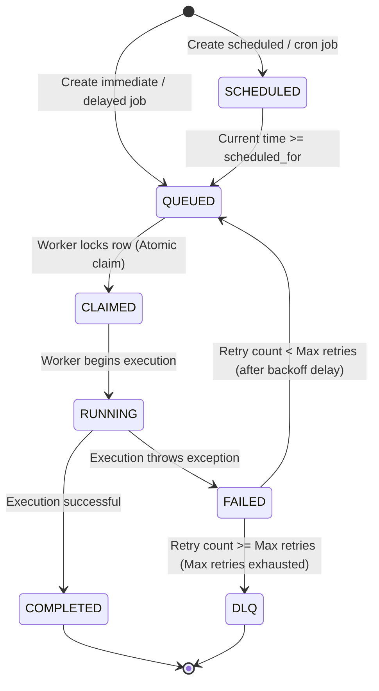

# FlowForge AI — Project Requirements & System Analysis

This document outlines the detailed requirements, specifications, and scope for **FlowForge AI**, a production-inspired intelligent distributed job scheduling and reliability platform.

---

## 1. Problem Statement
Modern distributed applications rely heavily on background workers for asynchronous tasks (e.g., email notification campaigns, data ingestion pipelines, report generation). Standard message-broker schedulers (like Celery with Redis/RabbitMQ) introduce several operational challenges:
- **Broker Complexity**: Managing external message queues introduces extra infrastructure, clustering overhead, and serialization complexities.
- **Transactional Gaps**: Queuing a job and committing a database transaction are separate operations. If the transaction rolls back but the job is already queued, the worker fails due to missing data (dual-write problem).
- **Lack of Multi-Tenancy**: Standard queues do not natively partition jobs by projects or organizations without deploying multiple broker virtual hosts.
- **Poor Concurrency & Queue Control**: Pausing individual queues or limiting concurrency per queue dynamically often requires complex scripting.
- **Debugging & Failure Diagnostics**: Diagnosing failing jobs is manual, requiring developers to inspect raw stack traces and logs.

**FlowForge AI** solves these issues by providing a **SQL-backed distributed scheduler** implemented in Python (using FastAPI, SQLAlchemy, and PostgreSQL). It ensures strict transaction boundary control, multi-tenant separation, granular queue priority and concurrency controls, worker heartbeats for automatic recovery, and built-in **AI-powered job failure analysis** to suggest remediations.

---

## 2. Target Users
- **Backend Software Engineers**: Who need a reliable, transaction-safe background job scheduling mechanism inside a relational database context.
- **System Architects**: Seeking a simplified infrastructure stack (avoiding extra Redis/RabbitMQ dependencies) with high reliability and visibility.
- **DevOps / Site Reliability Engineers (SREs)**: Requiring deep observability into worker health, queue bottlenecks, error rates, and automatic recovery.
- **Technical Support / Operators**: Using the web dashboard to inspect job execution history, trigger manual retries, and read AI failure diagnostics.

---

## 3. Real-world Use Cases
- **E-commerce Order Processing**: Creating delayed jobs for cart abandonment emails, immediate jobs for payment gateway communication, and scheduled jobs for daily inventory reconciliation.
- **Marketing Notifications**: Sending large batches of personalized emails or push notifications, where batch progress tracking and rate-limiting are required.
- **Data Synchronization & Ingestion**: Periodically fetching third-party API data (using cron-like recurring jobs) and processing records.
- **Report Generation**: Generating complex PDF/Excel reports in background worker threads, storing the logs, and updating the database status.
- **AI Task Pipelines**: Running batch inference or long-running machine learning evaluation tasks where jobs might fail and require structured retry strategies and error analysis.

---

## 4. Functional Requirements
- **Authentication**: Safe user registration and login. Token-based session management.
- **Multi-Tenant Hierarchy**: Organizations containing Projects. All queues, workers, and jobs must belong to a specific Project.
- **Granular Queue Management**: Dynamic queue registration, priority adjustments, concurrency limits, and pausing/resuming queues.
- **Job Scheduling & Execution**: Support immediate, delayed, scheduled, recurring (cron), and batch jobs.
- **Distributed Workers**: Multiple concurrently running worker instances polling the database atomically, executing jobs, and sending heartbeats.
- **Job Lifecycle & State Machine**: A well-defined state transitions model preventing duplicate claims or race conditions.
- **Robust Retry & DLQ System**: Auto-retry with configurable backoff policies (fixed, linear, exponential). Automatic redirection to the Dead Letter Queue (DLQ) upon retry exhaustion.
- **Observability & Logging**: Centralized execution logging, worker status registry, system health metrics, and throughput visualization.
- **Web Dashboard**: An interactive, responsive user interface for monitoring and manual operator control.
- **AI Failure Analysis**: Non-blocking diagnostics on failed jobs using a local LLM or free API to summarize exceptions and recommend fixes.

---

## 5. Non-functional Requirements
- **Reliability & Consistency**: At-least-once execution guarantee (no lost jobs due to worker crashes). Atomic operations to prevent duplicate runs (no two workers running the same job).
- **Concurrency Control**: DB-level locking (`SELECT ... FOR UPDATE SKIP LOCKED`) to coordinate distributed workers.
- **Performance**: Poll-latency under 50ms for workers checking for new jobs. Support for hundreds of jobs processed per second on standard PostgreSQL installations.
- **Scalability**: Ability to run multiple worker instances horizontally without central coordinator processes.
- **Security**: Strict authorization check ensuring that users can only view or modify resources in projects they have access to.
- **Ease of Setup**: Zero-dependency local setup using Docker Compose (PostgreSQL + FastAPI backend + React Vite frontend).

---

## 6. Authentication & Authorization Requirements
- **User Management**: Sign-up and login endpoints with secure password hashing (using `bcrypt`).
- **Session Security**: Token-based authentication using JSON Web Tokens (JWT) with configurable expiration (e.g., 24 hours).
- **Role-Based Access Control (RBAC)**: The system enforces the following permissions within a project or organization:
  - **Project Owner**: Full administrative privileges over the project.
    - Permissions: Manage project settings, configure queue priority/concurrency settings, create/pause/resume queues, inspect all jobs, view AI failure analysis, purge/delete jobs, and manage project member access.
  - **Developer**: Full operational privileges.
    - Permissions: Create and submit new jobs, view execution logs, view AI failure analysis, and trigger manual retries on failed or DLQ jobs. *Cannot* modify project/queue configurations or manage project members.
  - **Operator / Admin**: Operational monitoring and retry privileges.
    - Permissions: View system health metrics, monitor workers, view all queues, inspect job lists/logs, and trigger manual retries. *Cannot* create new jobs, edit queue configurations, or manage project members.
- **Project-Level Resource Isolation**:
  - The system must enforce strict isolation boundaries. All database query contexts must be scoped to the authorized `project_id` associated with the user's security token.
  - A user context must not be allowed to access, list, modify, or schedule queues, jobs, execution logs, or worker mappings of another project unless explicitly authorized with a valid role in that target project.


---

## 7. Organization/Project Requirements
- **Organizations**: High-level tenant container representing a company or department.
- **Projects**: Sub-compartment within an organization. All jobs, queues, execution logs, and configurations are namespace-isolated by `project_id`.
- **Isolation Guarantee**: Users authenticated to Project A must be prevented from reading, listing, modifying, or scheduling jobs in Project B.

---

## 8. Queue Requirements
Each project can define multiple queues. Queues have the following characteristics:
- **Priority**: Numeric or categorical (e.g., `Critical=10`, `High=5`, `Default=1`, `Low=0`). Workers prioritize claiming jobs from higher-priority queues.
- **Concurrency Limit**: Maximum number of jobs from this queue that can be executing concurrently across all workers. Useful for rate-limiting calls to external APIs.
- **State Control**: Dynamic pause and resume. When paused, workers are blocked from claiming any jobs from that queue, but new jobs can still be queued.
- **Statistics**: Expose real-time counts of jobs categorized by status: `QUEUED`, `RUNNING`, `COMPLETED`, `FAILED`, `DLQ`.

---

## 9. Job Requirements
Each job is a task record containing:
- **Identifier**: Globally unique UUID.
- **Payload**: JSON dictionary containing arguments for the task execution.
- **Target Handler**: Name of the Python function or task class that the worker must run (e.g., `tasks.send_email`).
- **Status**: The current state of the job in the lifecycle.
- **Priority**: Overridable priority at the job level.
- **Retry Policy**: Definition of maximum retry counts and backoff settings.
- **Timestamps**: `created_at`, `scheduled_for`, `claimed_at`, `started_at`, `finished_at`.
- **Idempotency Key**: Optional client-supplied key to prevent duplicate job insertion.

### 9.1 Job Timeout Policy
A formal policy manages how jobs that hang or exceed execution limits are handled:
- **Definition**: A job timeout is the maximum duration in seconds that a worker process is allowed to spend executing a specific job.
- **Configurability**: Every job can specify a custom `timeout` (in seconds) in its metadata configuration.
- **Default & Maximum Values**:
  - **Default Timeout**: 60 seconds (applied automatically if no custom timeout is defined).
  - **Maximum Timeout**: 3600 seconds (1 hour, to prevent runaway tasks from exhausting system resource capacity).
- **Execution Termination**:
  - The coordinator must terminate the isolated job execution process when the configured timeout is exceeded. The implementation must use the platform-appropriate process termination mechanism (for example, sending `SIGTERM` and escalating to `SIGKILL` if unresponsive on POSIX systems, or terminating the process tree on Windows) and must guarantee that a timed-out job cannot continue consuming worker execution capacity.
- **Status Marking & Retries**:
  - A timed-out job is marked as `FAILED` in the database, with its error message set to `JOB_TIMEOUT`.
  - The timeout event consumes exactly one retry attempt, incrementing the execution attempt count.
  - If the incremented attempt count is strictly less than `max_retries`, the job is scheduled for another run following the backoff policy.
  - If it matches or exceeds `max_retries`, the job is moved directly to the Dead Letter Queue (`DLQ`).
- **Interaction with Worker Heartbeats**:
  - The timed-out job's termination does *not* indicate worker node failure. The main worker process remains healthy, continues to transmit heartbeats to the database, and is freed to poll and execute new jobs.
  - This is distinct from worker failure, which is characterized by the worker process becoming completely unresponsive (stops sending heartbeats entirely).


---

## 10. Immediate Jobs
- Designed for tasks that need to run as soon as possible.
- When inserted, `scheduled_for` is set to the current timestamp.
- Available workers fetch and execute the job during their next polling cycle.

---

## 11. Delayed Jobs
- Target tasks scheduled to run after a specific interval (e.g., in 30 minutes).
- `scheduled_for` is set to `now() + delay_duration`.
- Workers ignore the job until the local system time passes the `scheduled_for` timestamp.

---

## 12. Scheduled Jobs
- Executed at a specific point in time (e.g., `2026-12-25T08:00:00Z`).
- The job remains in a `SCHEDULED` status until the database time matches or exceeds the specified run time.

---

## 13. Recurring (Cron) Jobs
- Uses standard cron expressions (e.g., `0 9 * * 1-5` for "every weekday at 9:00 AM").
- A scheduler process/thread regularly checks recurring configurations and inserts a new job record with `scheduled_for` set to the next calculated trigger time.
- Prevents overlapping executions: If a previously scheduled run is still running or queued, the system can be configured to either skip the next run or queue it anyway.

---

## 14. Batch Jobs
- **Grouping**: Ability to aggregate multiple independent job records into a single parent `Batch`.
- **Progress Tracking**: The batch record tracks overall statistics (e.g., Total Jobs: 100, Completed: 75, Failed: 5, Remaining: 20).
- **Callbacks**: Configurable trigger jobs that execute automatically once all jobs in the batch have reached a terminal state (`COMPLETED` or `DLQ`).

---

## 15. Worker Requirements
Workers are independent OS processes that:
- **Register**: Upon startup, write a new row to the `workers` table with metadata (host name, PID, concurrency capacity).
- **Poll**: Run a continuous loop querying the database for available jobs.
- **Claim**: Atomically update job rows from `QUEUED` to `CLAIMED` and associate them with their `worker_id`.
- **Execute**: Run task code concurrently.
- **Report**: Write final execution results, timestamps, and stack traces back to the database.
- **Deregister**: Safely clean up their database record upon graceful shutdown.

### 15.1 Worker Execution Model
An explicit execution model is required to define how worker instances handle concurrent executions, bypass the Python Global Interpreter Lock (GIL), isolate user-defined task execution to prevent crashes from cascading to the worker daemon, and provide deterministic execution timeouts.

#### Concurrency Mechanism Comparison
Below is a conceptual comparison of the primary concurrency mechanisms available in Python:

| Model | Concurrency Type | GIL Impact | Resource Overhead | Isolation | Timeout Termination |
| :--- | :--- | :--- | :--- | :--- | :--- |
| **Async (asyncio)** | Cooperative (Single Thread) | Locked (CPU blocks loop) | Extremely Low | None (shared space) | Hard (cannot kill sync/CPU blocks) |
| **Threads (threading)** | Preemptive (Shared Memory) | Locked (GIL active) | Low | Low (memory corruption risk) | Impossible (no native thread kill) |
| **Processes (multiprocessing)** | Preemptive (Isolated Memory) | Bypassed (True CPU parallelism) | Moderate/High | High (crashes don't impact parent) | Easy (SIGTERM/SIGKILL target pid) |

#### Selected Approach: Hybrid Async Coordinator + Process-Based Execution
FlowForge AI requires a **Hybrid Async Coordinator with a Process-Based Execution** model:

##### Async Coordinator
The main worker process runs an asynchronous event loop (`asyncio`) and is responsible conceptually for:
- **Database polling**: Periodically checking the database for new jobs to execute.
- **Worker registration**: Registering the worker instance metadata in the database on startup.
- **Heartbeat**: Sending periodic liveness heartbeats to the database.
- **Job supervision**: Supervising child execution processes and handling finished job status writes.
- **Lifecycle coordination**: Coordinating graceful shutdown signals (SIGINT/SIGTERM).

##### Process-Based Job Execution
Each job claimed by the coordinator is dispatched to run inside an isolated process using a platform-appropriate multiprocessing strategy. This isolated process is responsible conceptually for:
- **Executing individual jobs**: Executing the target Python job code and capturing output logs.
- **Isolation**: Keeping variables, libraries, and crash states completely separate from other tasks and the coordinator process.
- **CPU-bound work**: Running heavy CPU calculations without blocking the worker coordinator's event loop.
- **Timeout enforcement**: Allowing the coordinator to monitor elapsed execution time and terminate the process if it times out.
- **Failure containment**: Preventing segmentation faults, memory leaks, or unhandled exceptions in the job code from crashing the main worker process.

#### Justification for Selected Model
This hybrid model is selected to maximize reliability and simplicity in a Python/FastAPI environment:
1. **GIL Bypass**: Necessary to handle heavy CPU-bound tasks and network I/O concurrently without blocking worker heartbeats.
2. **Reliability and Fault Isolation**: A fatal error (e.g., segfault) in a job only kills the individual child process, leaving the worker coordinator active to log the failure and claim new jobs.
3. **Robust Timeout Termination**: Since threads cannot be killed natively in Python, process-based isolation is the only way to guarantee that a timed-out job can be forcefully terminated without leaving orphan task executions consuming system capacity.


---

## 16. Job Lifecycle
The state machine of a job must strictly adhere to:



---

## 17. Retry Requirements
- **Max Retries**: An integer parameter defining how many times a failed job can be re-run (default: 3).
- **Execution Counter**: Incrementing field tracking the current attempt number.
- **Non-blocking Backoff**: When a job fails and has remaining retries, the worker updates the status to `FAILED` and sets `scheduled_for` in the future according to the backoff strategy. The worker then releases the claim, allowing any worker to pick it up later.

---

## 18. Retry/Backoff Strategies
The platform supports three standard backoff mathematical models:
1. **Fixed-Delay**:
   $$t_{\text{wait}} = \text{base\_delay}$$
2. **Linear Backoff**:
   $$t_{\text{wait}} = \text{base\_delay} \times \text{attempt\_number}$$
3. **Exponential Backoff**:
   $$t_{\text{wait}} = \text{base\_delay} \times 2^{\text{attempt\_number} - 1}$$
   *Optionally includes random jitter to prevent thundering herd problems.*

---

## 19. Dead Letter Queue (DLQ) Requirements
- **Definition**: A state/table storing jobs that have permanently failed after exhausting all configured retries.
- **Metadata**: Retains original payload, target queue, execution count, historical failure logs, and the final exception message.
- **Operator Actions**:
  - **Replay/Retry**: Reset retry counter to 0 and move status back to `QUEUED` to run again.
  - **Cancel/Delete**: Remove the job or move it to a historical archive.

---

## 20. Worker Heartbeat & Failure Recovery Requirements
- **Heartbeat Interval**: Active workers must write a heartbeat timestamp to their registered row in the `workers` table every 5 seconds.
- **Liveness Checking Daemon**: A centralized, periodic background reaper process (run every 10 seconds) queries the database to identify unhealthy workers.
- **Failure Threshold**: A worker is declared `OFFLINE` (dead) if its last heartbeat timestamp is older than 15 seconds.

### 20.1 Worker Failure Semantics
When a worker is declared dead, its owned jobs must transition through the recovery pipeline:
- **Orphan Recovery Procedure**:
  - The reaper identifies all jobs associated with the dead `worker_id` that are in a `CLAIMED` or `RUNNING` state.
  - For each orphaned job, the reaper checks if the job's execution attempt count has exhausted the retry policy (`attempts >= max_retries`).
  - If attempts are exhausted, the job is moved directly to the Dead Letter Queue (`DLQ`).
  - If retries remain, the job's status is reset to `QUEUED`, its worker assignment is cleared, its attempt count is incremented, and its `scheduled_for` timestamp is set to `now() + backoff_delay` (making it immediately eligible for claim by other active workers after backoff).

### 20.2 Heartbeat / Reaper / Retry Race Condition
A critical distributed systems race condition exists in heartbeat-based failover designs:
1. **Worker A** claims **Job X** and starts running a long-running CPU task.
2. Due to high local CPU usage, database connection pool exhaustion, or a temporary network drop, **Worker A** fails to update its heartbeat row for 16 seconds.
3. The **Reaper** runs, identifies **Worker A** as dead, marks it `OFFLINE`, and recovers **Job X** (resetting its state to `QUEUED`).
4. **Worker B** polls the database, claims **Job X**, and begins executing it.
5. Meanwhile, **Worker A** completes **Job X** and attempts to write `status = 'COMPLETED'` to the database.
*Result*: Duplicate execution and corrupted job state, where two workers concurrently run and try to finalize the same job.

### 20.3 Correctness Guarantee via Fencing & Ownership Tokens
To prevent duplicate state writes and ensure correctness, the system must enforce the following fencing rules:
- **Ownership Fencing Identity**:
  - Every job row must maintain an `ownership_token` (e.g., a unique UUID generated during the claim transaction) or a monotonically increasing `version_id`.
  - When a worker claims a job, a new unique `ownership_token` is generated and saved in the job record alongside the worker assignment.
- **Stale Update Rejection**:
  - When any worker completes or fails a job and attempts to write its final state, the SQL statement must include a conditional check:
    ```sql
    UPDATE jobs
    SET status = :final_status, finished_at = now()
    WHERE id = :job_id AND worker_id = :worker_id AND ownership_token = :ownership_token;
    ```
  - If the reaper has already recovered the job, it will have cleared the worker assignment or updated the `ownership_token`. Thus, the stale worker's update query will match 0 rows.
- **Worker Self-Abortion**:
  - If a worker's update query returns a affected-rows count of 0, the worker must recognize it has lost ownership.
  - The worker must discard the task results, abort any further operations related to the job, and log a critical warning indicating it executed a stale task.
- **Liveness Recovery Catch-up**:
  - If a worker recovers from a temporary network partition and finds that its own registration has been marked `OFFLINE` or its executing job has been reassigned, it must terminate its active child tasks and re-register itself.


---

## 21. Graceful Shutdown Requirements
- **Signal Handling**: Workers must listen for `SIGINT` (Ctrl+C) and `SIGTERM`.
- **Action Plan**:
  - Stop polling the database for *new* jobs.
  - Wait for currently running jobs to complete within a configurable grace period (e.g., 30 seconds).
  - If jobs complete: Deregister and exit cleanly.
  - If grace period expires: Abort running jobs, mark those jobs as `FAILED` (with a "Worker terminated during execution" error), and exit.

---

## 22. Execution Logging
- Every attempt to run a job must be recorded in an `execution_logs` table.
- **Fields**: `id`, `job_id`, `worker_id`, `attempt_number`, `started_at`, `finished_at`, `status` (`SUCCESS` or `FAILURE`), `stdout`, `stderr`, `error_message`, and `stack_trace`.
- Logs must be persistent even if the job itself is deleted or moved to DLQ.

### 22.1 Log Retention & Maintenance Policy
To prevent execution logs from causing infinite database growth, the system must enforce the following log retention rules:
- **Configurable Retention Period**:
  - **Successful Jobs**: Logs are retained in the database for 30 days by default.
  - **Failed & DLQ Jobs**: Logs are retained in the database for 90 days by default to permit operator debugging and post-mortem analysis.
- **Pruning Mechanism**:
  - The background reaper process must execute a daily pruning task to delete log entries older than the configured threshold.
- **Size Limits & Truncation**:
  - Individual job executions must restrict their captured `stdout` and `stderr` logs to a maximum limit (e.g., 100KB per run).
  - If log output exceeds this threshold, the worker must truncate the log and append a warning message: `... [LOG TRUNCATED BY FLOWFORGE - EXCEEDED 100KB LIMIT]`.
- **Sensitive Data Protection**:
  - Capturing logs must implement a pre-save check that masks environment variables, API tokens, authorization headers, passwords, and private keys matching predefined regular expressions before writing them to the database (replacing them with `[MASKED]`).


---

## 23. Metrics
The backend must track and calculate:
- **Queue Depths**: Number of jobs in `QUEUED`, `RUNNING`, `FAILED`, and `DLQ`.
- **Worker Metrics**: Total active workers, total concurrent capacity, current load factor.
- **Execution Performance**: Average runtime of successful jobs, queue waiting latency (time between `scheduled_for` and `started_at`).
- **Throughput**: Number of successfully completed jobs per minute/hour.
- **Failure Rate**: Percentage of jobs failing versus successfully completing.

---

## 24. Observability
- **API Metrics Endpoint**: Exposed JSON metrics for scraping.
- **Logs Streaming**: API endpoint allowing chunked/paginated streaming of execution logs for any job.
- **Database Index Health**: Metrics monitoring slow queries or high lock contention on the `jobs` table.

---

## 25. API Requirements
All REST API endpoints must conform to:
- **Validation**: Strict schema checks using Pydantic. Return HTTP 422 for invalid payloads.
- **Authentication**: JWT token required in the `Authorization: Bearer <token>` header.
- **Response Format**: Uniform JSON envelopes:
  ```json
  {
    "success": true,
    "data": { ... },
    "meta": { "page": 1, "limit": 10, "total": 100 }
  }
  ```
- **Error Format**: Structured errors:
  ```json
  {
    "success": false,
    "error": {
      "code": "RESOURCE_NOT_FOUND",
      "message": "Job with UUID 1234-5678 not found",
      "details": null
    }
  }
  ```
- **Pagination**: Support `page` and `limit` (or `cursor`) queries on all list endpoints.
- **Filtering**: Allow filtering jobs by status, handler, queue, and created date range.

---

## 26. Frontend Requirements
An interactive Single Page Application (SPA) built with React and Vite:
- **Dashboard Overview**: Summary cards showing active workers, queue throughput chart, and critical system health alerts.
- **Queue Manager**: List of queues with buttons to Pause/Resume, adjust concurrency limits, and edit queue priority.
- **Job Explorer**: Searchable table of jobs with filtering by status, payload content, or handler. Click to inspect job details.
- **Worker Monitor**: Table of registered workers, showing PID, hostname, memory/CPU usage (if collected), active jobs count, and last heartbeat age.
- **Execution Log Viewer**: Terminal-style interface displaying stdout/stderr and stack traces for chosen job runs.
- **Failure Center**: Dedicated section containing DLQ jobs, highlighting the error messages, and providing a single-click "AI Remediation Analysis" and "Retry Job" buttons.

---

## 27. Security Requirements
- **Data Protection**: Store all passwords securely using bcrypt.
- **Transport Security**: Require HTTPS in production environments.
- **SQL Injection Prevention**: Ensure all database operations are performed via SQLAlchemy's ORM or prepared parameters (no raw string interpolation).
- **Access Isolation**: Verify the user belongs to the project of the job they are querying/updating at the controller level.
- **Rate Limiting**: Apply basic API rate limits (e.g., max 100 requests per minute per IP for authentication routes) to prevent brute-force attacks.

---

## 28. AI Failure-Analysis Requirements
- **Integration**: A background layer triggered either automatically upon job transition to `FAILED` or `DLQ` state, or manually via a UI request.
- **AI Core Functionality**: Reads the job payload, handler metadata, execution logs, and full Python exception stack trace. Feeds this data into a local text-generation LLM or lightweight API.
- **Analysis Schema**: Returns a JSON structure:
  ```json
  {
    "failure_summary": "Description of the error in plain English",
    "root_cause": "Identified root cause (e.g., missing API parameter, DB deadlock, timeout)",
    "severity": "LOW / MEDIUM / HIGH / CRITICAL",
    "suggested_remediation": "Step-by-step instructions or code changes to fix the bug",
    "retry_recommendation": "Whether retrying is likely to succeed or if it will fail deterministically"
  }
  ```
- **Failsafe & Decoupled Design**:
  - The core scheduling, execution, heartbeat, and retry engine must **never** depend on the availability of the AI service.
  - If the AI service is offline, crashes, runs out of memory, or fails to respond, jobs must still execute, retry, and transition to DLQ exactly as normal.
  - AI analysis execution must run asynchronously and outside of the critical transactional flow of worker execution loops (to prevent blocking worker threads or DB locks).

### 28.1 AI Analysis Lifecycle States & UI Behavior
To prevent confusing system operators, the dashboard UI and backend must track the state of the failure analysis independently from the job execution state:
- **AI Analysis States**:
  - `NOT_REQUESTED`: No failure analysis has been triggered yet.
  - `ANALYZING`: The analysis task is currently executing in the background.
  - `COMPLETED`: Analysis was successfully completed, and the results are ready to view.
  - `FAILED`: Analysis was attempted but the model execution failed or timed out.
  - `UNAVAILABLE`: The AI subsystem is globally disabled or offline.
- **UI Dashboard Requirements**:
  - The dashboard must clearly distinguish between the job's terminal execution state (`FAILED` or `DLQ`) and the status of the AI diagnostics.
  - Under no circumstances should the dashboard show a generic error or indicate that job management is broken if the AI service fails. It should display a clean notification: `"AI Failure Diagnostics: Unavailable"` or `"AI Diagnostics: Failed"`, while still displaying the raw stack traces and logs.
  - A failure or error in the AI analysis task **MUST NOT** modify or disrupt the actual job state or prevent manual retries.


---

## 29. Reliability Requirements
- **Transactional Safety (Out-of-box)**: Enable developers to insert jobs in the *same* database transaction as business logic. If the transaction commits, the job is guaranteed to run. If it rolls back, the job is never scheduled.
- **Locks and Deadlocks**: Use short transaction scopes for worker claiming. Avoid locking large sections of the `jobs` table to prevent DB bottlenecks.
- **At-least-once Guarantee**: A job is only marked `COMPLETED` when the worker successfully returns. If the worker crashes mid-job, the heartbeat check recovers and re-queues it.

---

## 30. Concurrency Requirements
- **Atomic Claiming**: Avoid double-claiming using the following pattern:
  ```sql
  UPDATE jobs
  SET status = 'CLAIMED', worker_id = :worker_id, claimed_at = now()
  WHERE id = (
      SELECT id FROM jobs
      WHERE status = 'QUEUED' AND scheduled_for <= now()
      ORDER BY priority DESC, created_at ASC
      LIMIT 1
      FOR UPDATE SKIP LOCKED
  )
  RETURNING *;
  ```
- **Queue-Level Concurrency Limit Invariant**:
  - For any queue with concurrency limit $N$, the number of actively executing jobs (defined as jobs in `CLAIMED` or `RUNNING` status) must **never** exceed $N$ globally across all workers.
  - *Example*: If Queue X has a concurrency limit of 2, and four workers (A, B, C, and D) are polling the queue simultaneously, at most 2 jobs from Queue X can be actively executing at any point.
- **Atomic Concurrency Verification**:
  - Checking the concurrency limit and claiming the job must be performed as a single atomic operation within a transaction to prevent race conditions.
  - When a worker attempts to claim a job, the select query MUST dynamically filter out any jobs belonging to queues that have already reached or exceeded their concurrency limit.
  - Specifically, candidate jobs are selected for locking only if:
    $$\text{Active Jobs in Queue } (\text{status} \in \{\text{'CLAIMED'}, \text{'RUNNING'}\}) < \text{Queue Concurrency Limit } N$$
  - Under database transactions, a database-level lock (such as row-level locks on the `queues` and `jobs` tables using `FOR UPDATE`) must isolate the query execution, preventing concurrent worker claim operations from violating the limit.


---

## 31. Idempotency Requirements
- **Idempotency Key Definition**:
  - An idempotency key is a client-generated unique identifier (such as a UUIDv4 or a cryptographic hash of the job payload, parameters, and handler name) passed during task submission.
- **Scoping & Uniqueness**:
  - The uniqueness constraint must be project-scoped, defined conceptually as the composite key:
    $$(\text{project\_id}, \text{idempotency\_key})$$
  - This prevents conflicts between different projects while ensuring absolute uniqueness within a single tenant project namespace.
- **Supported Operations**:
  - The job creation/scheduling REST endpoint: `POST /api/v1/projects/{project_id}/jobs`.
- **Handling Duplicate Submissions**:
  - If a job submission request is received with a duplicate `(project_id, idempotency_key)` pair:
    - **In-flight or Terminal Success (`QUEUED`, `RUNNING`, `COMPLETED`)**: The API must not queue a new job. Instead, it must intercept the request and return an HTTP `200 OK` (or `201 Created` depending on design preference) with the exact payload and current state of the existing job.
    - **Failed or DLQ State**: If the existing job is in a `FAILED` or `DLQ` state, the API must return the existing job's details to the client (informing them of the failure state). This avoids silent duplicate queue creation and prompts the client to utilize the manual retry endpoint or submit with a fresh key.
- **Retention & Purging Policy**:
  - Idempotency records must be retained in the database for a configurable retention window (default: 24 hours).
  - A background cleanup process (reaper) must delete expired idempotency key associations periodically to prevent unbounded database growth.


---

## 32. Testing Requirements
- **Backend Tests (Pytest)**:
  - Unit tests verifying the state machine transitions.
  - Concurrency tests spawning multiple threads/processes polling a mocked/local DB to verify no double claims occur.
  - Integration tests for retry algorithms, backoff calculations, and DLQ logic.
- **Mocking**: Full mock suite for the AI model component to ensure test runs do not require a live GPU or internet connection.
- **Frontend Tests**: Basic component validation and route transition tests using Jest or Vitest.

### 32.1 Requirements-Level Failure Scenario Test Specifications
To ensure the reliability of the system, the test suites must explicitly cover the following edge cases and failure modes:
1. **Job Timeout Execution**: Test that a job running longer than its configured timeout is forcefully terminated, its status is marked `FAILED` in the database, the exception log reports `JOB_TIMEOUT`, and exactly one retry attempt is consumed.
2. **Retry after Timeout**: Verify that a job failing due to timeout is rescheduled for execution in the future based on the correct backoff delay.
3. **Max Retry to DLQ**: Test that when a job's execution attempt count reaches `max_retries`, the job is transitioned directly to the Dead Letter Queue (`DLQ`).
4. **Queue Concurrency Limits**: Test that when Queue X has a concurrency limit of $N$, executing $M$ ($M > N$) parallel jobs from Queue X results in exactly $N$ jobs running simultaneously, while the remaining $M - N$ jobs stay in the `QUEUED` state.
5. **Simultaneous Worker Claims**: Simulate high concurrency by having multiple workers simultaneously execute the claiming query; verify that no single job is double-claimed or executed twice.
6. **Worker Heartbeat Loss**: Test that when a worker process stops updating its heartbeat row, the reaper identifies it as `OFFLINE` within the configured failure threshold (15s).
7. **Dead Worker Recovery**: Verify that when a worker goes `OFFLINE`, the reaper finds its executing jobs, increments their retry count, and resets their status to `QUEUED` (or transitions them to the DLQ if retries are exhausted).
8. **Stale Worker Update Rejection**: Simulate a slow worker where a network split causes its heartbeat to lag, resulting in the reaper recovering and re-queuing the job. When the slow worker finishes and tries to write the job status back to the DB, verify that the database update query affects 0 rows.
9. **Duplicate Execution Prevention**: Verify that the job's `ownership_token` check correctly prevents stale execution updates from overwriting the job's state.
10. **Idempotent Job Submission**: Verify that submitting two job requests with the same `(project_id, idempotency_key)` returns the same job record ID and details, and creates only a single row in the database.
11. **Authorization/Resource Isolation**: Verify that API requests to queue a job or view logs for Project B using credentials authorized only for Project A return HTTP `403 Forbidden`.
12. **AI Service Failure**: Verify that if the AI diagnosis service is completely offline, unreachable, or returns a 500 error, worker executions and job retry/DLQ transitions function successfully.


---

## 33. Documentation Requirements
The project must include complete and clear documentation files inside the `docs/` folder:
- `README.md` (Overview and setup)
- `PROJECT_STATUS.md` (Current build percentage, logs, and phase completion checklist)
- `CHANGELOG.md` (Version/phase updates)
- `01-project-requirements.md` (This document)
- `02-system-architecture.md` (System components and flowcharts)
- `03-database-design.md` (Tables, FKs, indices, and transactions)
- `04-api-documentation.md` (REST path parameters, request/response bodies)
- `05-concurrency-and-reliability.md` (Locking strategies, double-claim prevention, recovery)
- `06-ai-architecture.md` (Failure diagnostic workflow, failsafe design, prompt structure)
- `07-design-decisions.md` (Justification of SQL-native approach, async options, and stack choice)
- `08-security.md` (Auth, input scrubbing, project row-level checks)
- `09-testing-strategy.md` (Test suites, mocking strategy, and CI configurations)
- `10-deployment.md` (Docker Compose configuration, production database settings)

---

## 34. MVP Scope
The Minimum Viable Product (MVP) includes:
- Secure JWT User auth and registration.
- Project and Queue creation via API and UI.
- Immediate, Delayed, and Scheduled jobs execution.
- Single worker polling daemon executing tasks.
- Transactional atomic job claiming logic.
- Basic retry configuration (fixed delay).
- DLQ table with manual retry UI trigger.
- Simple dashboard listing queues, jobs, and execution logs.
- Basic AI analysis run on a failed job using a local Hugging Face transformer pipeline or lightweight Ollama model.

---

## 35. Bonus Scope
Features to consider post-MVP (strictly based on stability of the base system):
- **Workflow DAGs**: Job dependencies where Job B runs only after Job A completes successfully.
- **WebSocket updates**: Real-time stats push to the dashboard (instead of polling).
- **Job Rate Limiting**: Limit queue throughput to X jobs per second.
- **Dynamic Worker Auto-scaling**: Automatic container boot-up when queue depths spike.

---

## 36. Out-of-scope Features
- **Multi-region DB sharding**: We will assume a single PostgreSQL cluster instance.
- **SaaS billing system integration**: No Stripe/payment integration.
- **Custom serialization engine**: Standard JSON payloads only (no Pickle or custom binary formats to avoid security/compatibility risks).

---

## 37. Risks
- **Database Lock Saturation**: If hundreds of worker threads run `SELECT FOR UPDATE SKIP LOCKED` continuously, DB CPU and transaction log overhead may spike. *Mitigation: Tune polling interval and use exponential backoff on workers when queues are empty.*
- **Resource Exhaustion**: If a worker runs a job that crashes or leaks memory, the node might go offline. *Mitigation: Implement resource limits per task process and set up worker heartbeats for orphan recovery.*
- **AI Latency**: LLM generation might take 2-5 seconds. If run synchronously during worker executions, it will block worker threads. *Mitigation: Run AI analysis asynchronously or as a background task, separate from core worker execution loops.*

---

## 38. Technical Trade-offs
- **SQL DB vs Redis/RabbitMQ**: Redis is extremely fast but lacks transaction safety for business database state and is transient by default. PostgreSQL allows transactional scheduling (job is queued only if user data is committed) but has lower polling throughput limit. *Decision: Choose PostgreSQL to ensure maximum reliability and transactional guarantees for low-to-medium throughput workloads.*
- **Local Hugging Face vs OpenAI**: Local models have no API keys, zero cost, and function offline, but require GPU/CPU hardware. OpenAI is fast and high-quality but requires paid API keys and network access. *Decision: Use local model (Hugging Face transformers or Ollama) with a fallback to mock data, keeping the installation free and self-contained.*

---

## 39. Open Questions
- What is the best way to handle task code importing? Should we dynamically import task modules on the worker, or define registered tasks statically?
- How should we represent job timeouts? Should we enforce timeouts at the OS level (e.g., using signals) or in asyncio tasks?

---

## 40. Initial Technology-Stack Proposal
- **Backend**: Python 3.11+, FastAPI, SQLAlchemy 2.0 (asyncpg), Alembic, Pydantic v2.
- **Database**: PostgreSQL 15+.
- **Frontend**: React, Vite, Tailwind CSS, Axios, Recharts (for throughput charts).
- **AI Layer**: Hugging Face pipeline (using `transformers` library, e.g., a tiny model like Google's Flan-T5) or mock diagnostic generator if resources are constrained.
- **Infrastructure**: Docker and Docker Compose.
- **Testing**: Pytest, Pytest-asyncio.
