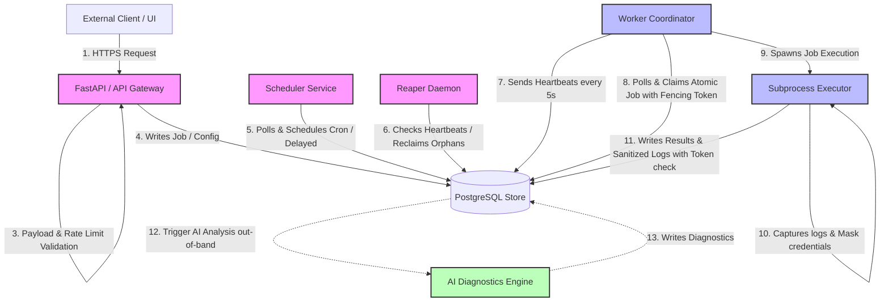

# FlowForge AI — Logical Module & Class Layouts

This document defines the logical module hierarchy and class layouts for **FlowForge AI**. It maps the architectural boundaries established in Phase 2.1 into specific logical software components, defining their responsibilities, dependencies, inputs, outputs, invariants, and constraints.

---

## 1. Purpose
This document translates high-level system boundaries and correctness goals into a concrete, implementation-agnostic software design:

```
Phase 1 Requirements
        ↓
Phase 2.1 System Architecture
        ↓
Phase 2.2 Module & Class Layouts (This Document)
        ↓
Phase 2.3 Detailed API Contracts & Database Schema Design
        ↓
Implementation & Testing Phases
```

By specifying logical components, state boundaries, dependency directions, and failure responsibilities before writing code, we ensure a maintainable codebase that isolates execution faults, enforces transaction correctness, and prevents circular dependencies.

---

## 2. Architectural Boundaries
The software components are divided into three distinct operational planes:

```
┌─────────────────────────────────────────────────────────────┐
│                       CONTROL PLANE                         │
│  [API / Gateway] ──► [Scheduler] ──► [Reaper] ──► [DB Store]│
└──────────────────────────────┬──────────────────────────────┘
                               │ (Polls & Updates via SQL)
                               ▼
┌─────────────────────────────────────────────────────────────┐
│                      EXECUTION PLANE                        │
│             [Worker Coordinator] ──► [Executor]             │
└──────────────────────────────┬──────────────────────────────┘
                               │ (Asynchronous Error Trigger)
                               ▼
┌─────────────────────────────────────────────────────────────┐
│                    AI DIAGNOSTICS PLANE                     │
│                  [AI Diagnostics Engine]                    │
└─────────────────────────────────────────────────────────────┘
```

- **Control Plane**: Authoritative operations managing system metadata, user authentication, RBAC, route verification, job submission, queue definitions, cron scheduling logic, batch callback evaluation, and global failure detection/reclaiming (Reaper).
- **Execution Plane**: Concurrent worker operations managing worker registration, heartbeats, database claim locks, subprocess spawning, execution sandboxing, timeout enforcement, log collection, and execution result reporting.
- **AI Diagnostics Plane**: Isolated asynchronous diagnostic handlers that analyze job logs and trace records to identify failure root causes and suggest remediations. It has zero authority to block or modify core scheduling or execution paths.

---

## 3. Module Hierarchy
The software structure is organized into the following logical directory hierarchy:

```
flowforge_ai/
│
├── control_plane/
│   ├── auth/              # JWT, User Authenticator, Password Hashing
│   ├── projects/          # Project Administration, Workspace Isolation
│   ├── queues/            # Queue Configs, Concurrency Thresholds
│   ├── jobs/              # Job Lifecycle, Input Validation, Idempotency Checks
│   ├── batches/           # Batch Aggregation, Callback Resolution
│   ├── scheduler/         # Cron parser, Delay Trigger, Grace-Window checks
│   ├── recovery/          # Reaper daemon, Orphaned claim re-queuer
│   └── rate_limiting/     # Control-plane boundary rate limits
│
├── execution_plane/
│   ├── worker/            # Worker coordinator, Registry, Heartbeat Loop
│   ├── claimer/           # Concurrency-safe claim lock selector
│   ├── executor/          # Isolated subprocess runner, CPU/RAM monitor
│   └── logger/            # Stdout/Stderr log interceptor, masking & limits
│
├── ai_diagnostics/
│   ├── diagnostic_engine/ # Asynchronous LLM client & prompt wrapper
│   └── diagnostic_state/  # Non-blocking analysis status updates
│
└── config/                # Platform global settings loader
```

---

## 4. Logical Components / Classes
This section defines the logical component classes required for each module.

### 4.1 Control Plane Components

#### `Authenticator`
- **Responsibility**: Authenticates users and generates security tokens.
- **Owned Behavior**: User credential verification, JWT token signing, validation, and expiration enforcement.
- **Dependencies**: Database connection.
- **Inputs**: Username, Password, or JWT token.
- **Outputs**: Signed JWT token, User identity, Roles list.
- **Boundary**: Control Plane - API Boundary.
- **Invariants**: JWT tokens must have a hard-coded expiration and be signed with a cryptographically secure key.
- **Must NOT own**: Role checks (handled by Authorizer), Project validation checks.

#### `Authorizer`
- **Responsibility**: Enforces Role-Based Access Control (RBAC) and project boundaries.
- **Owned Behavior**: Maps permissions by checking user-project bindings against requested operations.
- **Dependencies**: Authenticator.
- **Inputs**: User Identity, Target Resource (Job/Queue), Requested Action (Create/Read/Update/Delete).
- **Outputs**: Boolean (Access Granted/Denied).
- **Boundary**: Control Plane.
- **Invariants**: No operation on project resources is permitted unless the user has a valid role (`Project Owner`, `Developer`, or `Operator`) bound to that specific `project_id`.
- **Must NOT own**: Database state modification, authentication token parsing.

#### `RateLimiter`
- **Responsibility**: Protects the API gateway from request floods and DoS.
- **Owned Behavior**: Tracks request count per IP/user within fixed windows; rejects excess requests.
- **Dependencies**: Implementation-agnostic rate-limiting state store.
- **Inputs**: Client IP, Authenticated User Identity, Route Endpoint.
- **Outputs**: Access status (Allow / Block HTTP 429).
- **Boundary**: Control Plane - Outer Boundary.
- **Invariants**: Evaluates and rejects requests before passing context to Authenticator, Authorizer, or database.
- **Must NOT own**: Job state changes, business logic rate rules.

#### `JobValidator`
- **Responsibility**: Ensures job payloads conform to system boundaries before acceptance.
- **Owned Behavior**: Enforces maximum payload JSON size (default **100 KB**) and Pydantic validation schemas.
- **Dependencies**: None.
- **Inputs**: Job Target Handler, JSON Payload dictionary.
- **Outputs**: Validated data payload, or Validation Exception (HTTP 413 / HTTP 422).
- **Boundary**: Control Plane.
- **Invariants**: If the JSON payload exceeds 100 KB (102,400 bytes), the validator must immediately raise a `PayloadTooLarge` exception.
- **Must NOT own**: Database insertions, queue concurrency validation.

#### `IdempotencyManager`
- **Responsibility**: Prevents duplicate job submissions from client retry loops.
- **Owned Behavior**: Checks for existing jobs matching a composite identity key; retrieves existing records.
- **Dependencies**: Database connection.
- **Inputs**: `project_id`, Client-supplied `idempotency_key`.
- **Outputs**: Existing Job ID and details (if found), or indicator to proceed with creation.
- **Boundary**: Control Plane.
- **Invariants**: Scoped strictly to `(project_id, idempotency_key)` to prevent cross-tenant key collision.
- **Must NOT own**: Job creation logic, job execution updates.

#### `SchedulerService`
- **Responsibility**: Regularly evaluates cron configurations and schedules delayed jobs.
- **Owned Behavior**: Calculates next trigger times, detects missed executions, and queues scheduled executions.
- **Dependencies**: Database connection.
- **Inputs**: Scheduler trigger signal.
- **Outputs**: New queued job records.
- **Boundary**: Control Plane.
- **Invariants**:
  - Enforces `(cron_config_id, scheduled_for)` unique constraint database-level checks.
  - Enforces `missed_run_policy` behaviors: `RUN_ONCE` (15-minute grace period trigger / skip if older), `FORCE_RUN` (always queue one), and `SKIP` (never queue catch-up).
- **Must NOT own**: Worker coordination, subprocess launching.

#### `BatchManager`
- **Responsibility**: Coordinates child jobs grouped into batches and triggers callbacks.
- **Owned Behavior**: Evaluates terminal status criteria, determines batch outcome (`SUCCESS` or `FAILED`), and initiates batch callback configurations.
- **Dependencies**: Database connection.
- **Inputs**: Completion event for a child job.
- **Outputs**: Batch state change events, callback job creation.
- **Boundary**: Control Plane.
- **Invariants**:
  - A batch resolves to a terminal state if and only if **all** associated child jobs are in `COMPLETED` or `DLQ` states.
  - Resolves to `SUCCESS` if 100% of child jobs are `COMPLETED`. Resolves to `FAILED` if at least one child job resides in `DLQ`.
  - Executes batch callbacks according to trigger policies: `ALWAYS`, `ON_SUCCESS`, `ON_FAILURE`, or `NEVER`.
- **Must NOT own**: Child job execution, job timeout monitoring.

#### `Reaper`
- **Responsibility**: Monitors worker registries and recovers orphaned jobs.
- **Owned Behavior**: Periodic sweeps of worker heartbeat timestamps, flagging expired nodes, and resetting associated active jobs.
- **Dependencies**: Database connection.
- **Inputs**: Reaper timer tick.
- **Outputs**: De-registered workers (`OFFLINE`), reclaimed jobs.
- **Boundary**: Control Plane.
- **Invariants**:
  - Marks a worker `OFFLINE` if its heartbeat is older than 15 seconds.
  - Reschedules reclaiming jobs back to `QUEUED` if retries are remaining, or routes them to the `DLQ` if retries are exhausted.
- **Must NOT own**: Active job execution, log collection during execution.

---

### 4.2 Execution Plane Components

#### `WorkerCoordinator`
- **Responsibility**: Manages the local worker node registry and coordinates execution capacity.
- **Owned Behavior**: Node self-registration, periodic heartbeat emission, capacity tracking (max concurrent tasks).
- **Dependencies**: Database connection, `Claimer`, `Executor`.
- **Inputs**: Operating system signals, capacity availability.
- **Outputs**: Database heartbeat updates, task claiming triggers.
- **Boundary**: Execution Plane.
- **Invariants**: Must emit heartbeats exactly every 5 seconds. If database updates fail, it backoffs and checks liveness.
- **Must NOT own**: Global failure checks of *other* worker nodes (handled by Reaper).

#### `Claimer`
- **Responsibility**: Atomically claims eligible jobs from PostgreSQL.
- **Owned Behavior**: Locks job rows, verifies queue-level concurrency limits, and issues fencing tokens.
- **Dependencies**: Database connection.
- **Inputs**: Queue subscription lists, Worker ID.
- **Outputs**: Claimed Job record containing the `ownership_token`, or null.
- **Boundary**: Execution Plane.
- **Invariants**:
  - Must evaluate queue concurrency thresholds ($N$) atomically in the database during claiming.
  - Generates a unique UUID `ownership_token` upon claiming to lock out stale writes.
- **Must NOT own**: Task execution, process timeout tracking.

#### `Executor`
- **Responsibility**: Spawns and monitors isolated task processes, producing execution results without acting as the authoritative owner of the job state.
- **Owned Behavior**: Isolated process instantiation, standard output/error capture, and process timeout monitoring.
- **Dependencies**: `ExecutionLogger`.
- **Inputs**: Claimed Job record, task target handler code.
- **Outputs**: Standard output, standard error, execution status results.
- **Boundary**: Execution Plane.
- **Invariants**:
  - Executes task code strictly in an isolated process context to isolate execution failures and protect worker memory.
  - Forcefully terminates the execution process context immediately when execution duration exceeds the job's defined timeout threshold.
  - Must write execution outcomes conditionally via database fencing tokens, preserving PostgreSQL as the authoritative job state store.
- **Must NOT own**: Queue concurrency state, worker heartbeats.

#### `ExecutionLogger`
- **Responsibility**: Captures and sanitizes standard output/error logs from task executions.
- **Owned Behavior**: Intercepts process streams, masks credentials, and truncates streams to a hard limit (default **100 KB**).
- **Dependencies**: None.
- **Inputs**: Raw standard output/error streams from subprocesses.
- **Outputs**: Sanitized, truncated log text.
- **Boundary**: Execution Plane.
- **Invariants**: Masks matched environment credentials and strictly truncates output before database write if log size exceeds 100 KB.
- **Must NOT own**: Authoritative job state fields.

---

### 4.3 AI Diagnostics Plane Components

#### `AIDiagnosticsEngine`
- **Responsibility**: Interacts with the AI model to analyze failed job executions.
- **Owned Behavior**: Assembles failure context, calls local LLM/API wrappers, and formats diagnostic outputs.
- **Dependencies**: Database connection.
- **Inputs**: Failed Job ID, Sanitized Execution logs, Stack trace records.
- **Outputs**: Failure cause classification, Remediation suggestions, model metadata.
- **Boundary**: AI Diagnostics Plane.
- **Invariants**: Executed entirely out-of-band as a non-blocking asynchronous task.
- **Must NOT own**: Job state transitions, retries, scheduling, or control flow decisions.

#### `DiagnosticStateManager`
- **Responsibility**: Updates job-associated AI diagnostic records in PostgreSQL.
- **Owned Behavior**: Tracks diagnostic pipeline states: `NOT_REQUESTED`, `ANALYZING`, `COMPLETED`, `FAILED`, `UNAVAILABLE`.
- **Dependencies**: Database connection.
- **Inputs**: AI Engine status changes.
- **Outputs**: Database updates to diagnostic record fields.
- **Boundary**: AI Diagnostics Plane.
- **Invariants**: If the AI model crashes or times out, transitions state to `FAILED` or `UNAVAILABLE` without modifying the core job state.
- **Must NOT own**: Core scheduling states (`QUEUED`, `CLAIMED`, `RUNNING`, `COMPLETED`, `FAILED`).

---

## 5. Dependency Direction

### 5.1 Allowed Dependencies
- **Control Plane** components depend on the **PostgreSQL Database** for persistence.
- **Execution Plane** components query the **Control Plane** schema via PostgreSQL and write heartbeats, claimed records, and job results.
- **AI Diagnostics Plane** reads from PostgreSQL (jobs, logs) and writes diagnostic summaries.

### 5.2 Forbidden Dependencies
- **Control Plane** MUST NOT depend on the **Execution Plane** (the API, Scheduler, and Reaper are unaware of specific worker process thread layouts).
- **Control Plane** and **Execution Plane** MUST NOT depend on the **AI Diagnostics Plane** (AI availability is completely optional).
- Authoritative persistent state is accessed through PostgreSQL. Modules must respect defined dependency boundaries. Components must not bypass another module's ownership boundaries or directly mutate state they do not own. Circular dependencies (e.g. `Executor` calling `Authenticator`) are strictly forbidden.

```
┌───────────────────┐       ┌─────────────────┐
│   Control Plane   │◄──────┤ Execution Plane │
└─────────┬─────────┘       └────────┬────────┘
          │                          │
          ▼                          ▼
┌─────────────────────────────────────────────┐
│             PostgreSQL Database             │
└──────────────────────▲──────────────────────┘
                       │
            ┌──────────┴──────────┐
            │ AI Diagnostics Plane│
            └─────────────────────┘
```

---

## 6. State Ownership
PostgreSQL is the exclusive authoritative owner of all system state. Individual components own the logic for mutation, executing transitions via transaction blocks:

- **Job State**: Evaluated and transitioned by `Claimer` (to `CLAIMED`/`RUNNING`), `Executor` (to `COMPLETED` or `FAILED`), and `Reaper` (reverting to `QUEUED` or routing to `DLQ`).
- **Batch State**: Monitored and mutated by `BatchManager` upon child job completion.
- **Worker State**: Evaluated by the `Reaper` scanning the heartbeats registry; updated periodically by the `WorkerCoordinator`.
- **Scheduler State**: Maintained in database tables tracking cron definitions, next runtime schedules, and occurrence limits.
- **DLQ State**: Transitioned by the `Reaper` or `Executor` once retry thresholds are breached.
- **Diagnostic State**: Mutated by `DiagnosticStateManager` out-of-band.

---

## 7. Concurrency Responsibilities
- **Job Claiming**: Performed atomically by the `Claimer` class, querying eligible jobs while calculating queue limits using row-level database locks.
- **Fencing (Stale Write Prevention)**: The `Claimer` creates a unique `ownership_token` UUID when a job is claimed. Any job update query executed by an `Executor` must include `WHERE id = :job_id AND ownership_token = :token`. If zero rows are updated, the write is rejected as stale.
- **Heartbeat & Reaper**: The `WorkerCoordinator` writes heartbeats to the registry database every 5 seconds. The `Reaper` periodically scans this table. If a heartbeat is older than 15 seconds, the worker is marked offline and its active jobs are re-queued.

---

## 8. Scheduler Responsibilities
- **Cron Scheduling**: The `SchedulerService` calculates upcoming execute times using standard cron format specs.
- **Grace-Window Enforcement**: Upon system recovery, the `SchedulerService` applies `RUN_ONCE` logic: catch up the run if missed trigger is within the **15-minute grace period**, otherwise skip to the next scheduled interval.
- **Trigger Policies**: Supports `RUN_ONCE` (grace-dependent catch-up), `FORCE_RUN` (unconditional catch-up run), and `SKIP` (never catch up).
- **Duplicate Occurrence Check**: A unique database constraint on `(cron_config_id, scheduled_for)` ensures that only one job record is ever created for a specific cron trigger slot.

---

## 9. Batch Responsibilities
- **Terminal State Logic**: The `BatchManager` checks if all children have reached terminal statuses (`COMPLETED` or `DLQ`).
- **Batch Resolution**: Resolves to `SUCCESS` if all child executions succeeded; resolves to `FAILED` if any child ended in the `DLQ`.
- **Callbacks**: Evaluates the terminal batch state against the batch's `callback_trigger_condition` (`ALWAYS`, `ON_SUCCESS`, `ON_FAILURE`, `NEVER`) and schedules the callback job accordingly.

---

## 10. Worker / Execution Responsibilities
- **WorkerCoordinator**: Tracks execution capacity, polls the database, coordinates job claiming, and updates heartbeats.
- **Executor**: Sets up isolated environments, monitors task durations, and traps system crashes.
- **Process Isolation**: Enforced by the `Executor` launching task handlers in an isolated process context to insulate the coordinator.
- **Timeout Monitoring**: Monitored by the `Executor` to forcefully terminate the execution process context if timeout thresholds are breached.

---

## 11. Failure & Recovery Responsibilities
- **Worker Coordinator Crash**: Detected by `Reaper` via heartbeat expiration. `Reaper` handles recovery (resetting job states).
- **Scheduler Crash**: Handled by restarting the `SchedulerService` daemon, which processes missed runs according to their policy.
- **Network Partition**: The `WorkerCoordinator` loses connection, preventing heartbeats. The `Reaper` declares the worker offline and reassigns jobs. When the partitioned worker tries to commit results, the fencing check fails, and the `Executor` aborts.
- **Job Timeout**: Detected by `Executor`'s timeout monitor, which terminates the process, marks the job failed, and logs `JOB_TIMEOUT`.
- **Retry Exhaustion**: Evaluated on job failure. If retries are remaining, the job is rescheduled back to `QUEUED`. If retries are exhausted, the job is routed to the `DLQ`.

---

## 12. AI Diagnostics Responsibilities
- **Decoupled Boundary**: The `AIDiagnosticsEngine` runs completely asynchronously.
- **Fault Isolation**: If the AI engine times out, fails, or throws exceptions, it must not affect task execution, retries, scheduling, or recovery.
- **Diagnostic Output**: Analysis results are stored in diagnostic tables, keeping the core job table clean of prompt data.

---

## 13. Security Responsibilities
- **Authentication**: `Authenticator` enforces JWT token signature checks.
- **Authorization**: `Authorizer` enforces project-scoped RBAC, blocking cross-project data manipulation.
- **API Boundary Protection**: `RateLimiter` and `JobValidator` block malicious traffic and excessively large payloads at the outer FastAPI gateway before they reach the database or scheduling logic.

---

## 14. Observability Responsibilities
- **Job Logs**: Subprocess streams are collected by the `ExecutionLogger`, sanitized, masked, truncated to 100 KB, and written to PostgreSQL.
- **Worker Heartbeats**: Heartbeats are written to the database every 5 seconds to provide real-time node cluster mapping.
- **Metrics**: Maintained in database statistics tables and exposed as structured API outputs.

---

## 15. Configuration Responsibilities
- **Retrieval**: System configurations (retry backoffs, rate limit counts, payload limits, heartbeat frequencies) are loaded globally by the `config/` module.
- **Invariants**: Key constraints (like the default 15-minute grace window and 100 KB payload size limit) are codified as default system settings.

---

## 16. Module Interaction Diagram

The diagram below maps the interaction boundaries between components:



---

## 17. Dependency Rules
1. **No Direct Mutation**: No execution component is permitted to write or mutate core job configurations without updating PostgreSQL first.
2. **AI Optionality**: Core schedulers and worker processes must never import or depend on packages inside the `ai_diagnostics/` module.
3. **No Execution in API**: The FastAPI gateway layer is stateless and must never block, poll, or execute user-defined tasks.
4. **Fencing Verification**: Every database update query on job statuses executed by workers must verify the `ownership_token`.
5. **No Circular Dependencies**: Lower-level execution engines cannot depend on higher-level API/Control interfaces.

---

## 18. Non-Goals
This document does **not** define or implement:
- Database table columns, SQL queries, index layouts, or database migrations.
- API REST path details, router files, or request/response validation schemas.
- Implementation python code, classes, or specific asyncio execution syntaxes.
- Python task handler registration codes or directories.
- Multiprocessing or subprocess execution APIs.
- AI LLM prompt templates, providers, or local API configurations.
- Docker network maps, Compose environments, or deployment configurations.

---

## 19. Open Decisions
The following decisions remain intentionally deferred to later sub-phases:
1. **State-Transition Model**: The specific string constants representing job states and database state transitions.
2. **Atomic Claim Query**: The exact SQL syntax for joining queues, counting concurrency, and locking rows.
3. **Cron Parsing Engine**: Selecting a third-party library (e.g. `croniter`) for parsing cron intervals.
4. **Worker Executor Multiprocessing API**: Selecting whether tasks are launched using standard library `subprocess` or `multiprocessing`.
5. **Heartbeat & Reaper Timers**: Tuning the default interval and offline threshold values based on performance tests.
6. **Token/JWT Secret Management**: Choosing how environment secrets are loaded (e.g. env variables, dotenv files).
7. **AI Hosting Interface**: Determining whether the LLM diagnostics call local Ollama libraries, subprocess calls, or mock tools.
8. **Log Storage Strategy**: Deciding if captured stdout/stderr streams are stored in PostgreSQL tables or kept on local filesystems with path references in SQL.
9. **Rate-limiting Implementation**: The exact rate-limiting mechanism, cache metadata/state store choice, and specific endpoint thresholds.
