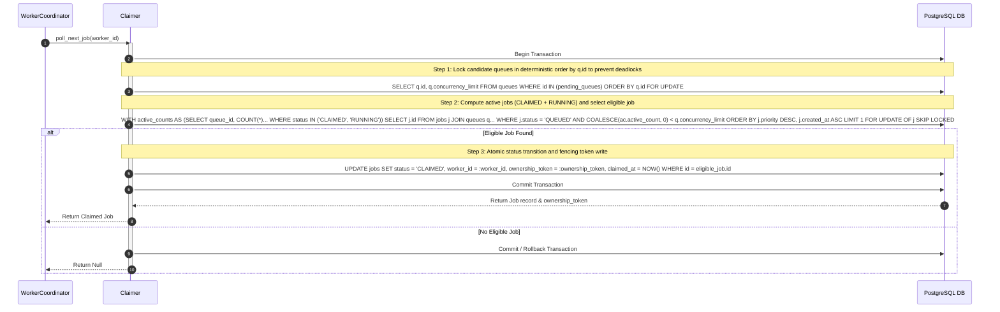
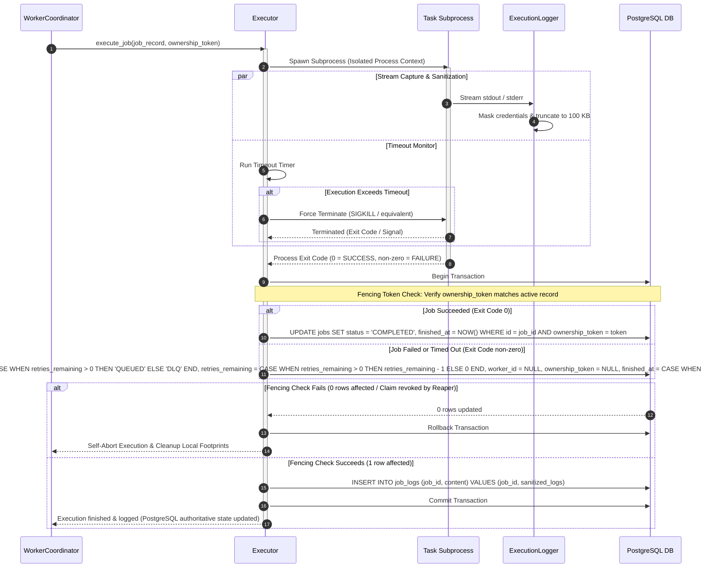
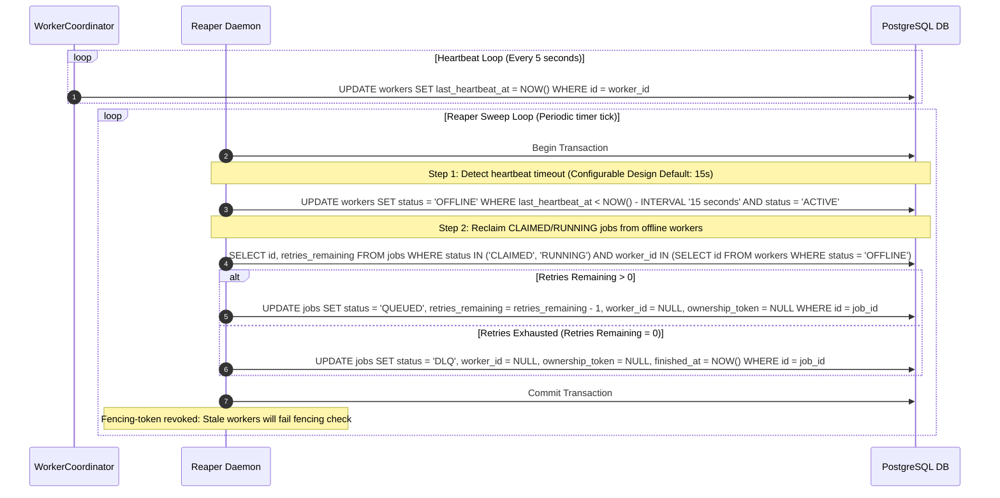
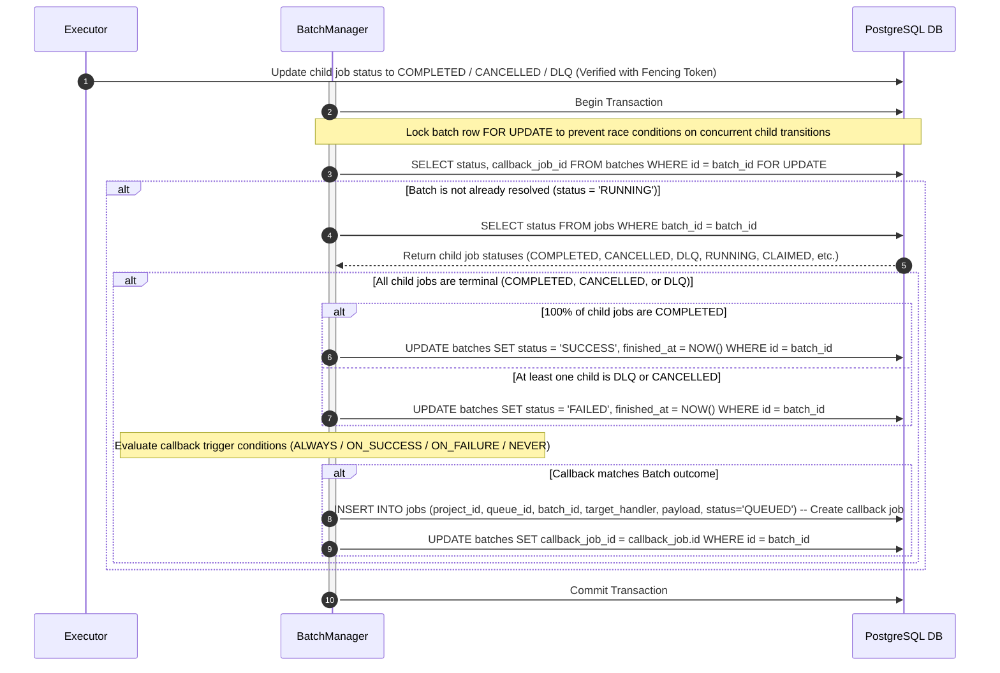

# FlowForge AI — Sequence Flows & Interaction Designs

This document defines the core runtime execution flows and sequence designs for **FlowForge AI**. It specifies how the logical modules and database layers interact to execute tasks, enforce concurrency limits, handle failures, and guarantee transaction correctness.

---

## 1. Purpose
This design document maps out the specific runtime sequences for critical platform operations. By tracing the exact step-by-step messaging, locking, and status updates, we ensure that:
- Race conditions are eliminated in concurrent schedulers and worker claims.
- Concurrency limits are strictly enforced at the database level.
- Stale workers are prevented from writing invalid results using versioned fencing tokens.
- Deadlocks are mitigated during multi-queue claiming.

---

## 2. Sequence Designs

### 2.1 Job Claiming & Queue Concurrency Locking Flow
This flow tracks how a worker coordinator claims the next available job while dynamically checking queue concurrency limits.



---

### 2.2 Worker Job Execution & Sandbox Isolation Flow
This flow details how the worker coordinator delegates execution to the executor process context, captures/sanitizes streams, and writes back results with fencing checks.



---

### 2.3 Worker Liveness & Reaper Orphan Recovery Flow
This flow shows the heartbeat mechanism emitted by workers and the periodic reclaim sweeps executed by the Reaper daemon.



---

### 2.4 Cron/Scheduler Occurrence Prevention Flow
This flow outlines how the Scheduler daemon calculates scheduled times, applies missed run grace window rules, and prevents duplicate occurrence queuing.

```mermaid
sequenceDiagram
    autonumber
    participant S as SchedulerService
    participant DB as PostgreSQL DB

    loop Scheduler Loop (Periodic evaluation tick)
        S->>DB: Begin Transaction
        S->>DB: SELECT * FROM cron_configs WHERE next_scheduled_at <= NOW() FOR UPDATE
        S->>S: Calculate next occurrence scheduled_for time

        alt Downtime Detected (Recovery Catch-up Check)
            Note over S: Missed window policy verification (Configurable Grace Window Default: 15m)
            alt Policy = RUN_ONCE
                alt Missed run is within 15 minutes of scheduled time
                    S->>DB: INSERT INTO jobs (project_id, queue_id, cron_config_id, scheduled_for, status='QUEUED')
                else Missed run is older than 15 minutes
                    Note over S: Skip missed occurrence, calculate next natural interval
                end
            alt Policy = FORCE_RUN
                S->>DB: INSERT INTO jobs (project_id, queue_id, cron_config_id, scheduled_for, status='QUEUED')
            alt Policy = SKIP
                Note over S: Skip missed run completely, proceed to calculate next natural runtime
            end
        else Natural Run Interval
            S->>DB: INSERT INTO jobs (project_id, queue_id, cron_config_id, scheduled_for, status='QUEUED')
        end

        alt Uniqueness Conflict: UNIQUE(cron_config_id, scheduled_for)
            DB-->>S: UNIQUE Constraint Violation (Occurrence already exists)
            S->>DB: Rollback Transaction (Conflict handled safely, no duplicate job queued)
        else Commit Success
            S->>DB: UPDATE cron_configs SET last_scheduled_at = next_scheduled_at, next_scheduled_at = calculated_next_time WHERE id = config_id
            S->>DB: Commit Transaction
        end
    end
```

---

### 2.5 Batch Child Completion & Callback Resolution Flow
This flow maps out how child jobs report completion, how BatchManager evaluates terminal state progress, and how callback tasks are dynamically scheduled.



---

## 3. Interaction Correctness Rules

### Rule 1: Deterministic Lock Acquisition Order
To eliminate inter-plane transaction deadlocks when locking resources concurrently across multiple components, the platform must acquire locks in a globally defined hierarchical order:
1. **Queues Lock**: Acquired first (e.g. `queues FOR UPDATE` ordered by `q.id` during claim operations) to lock queue concurrency state.
2. **Jobs Lock**: Acquired second (e.g. `jobs FOR UPDATE` on specific job rows during claiming or status transition).
3. **Batches Lock**: Acquired third (e.g. `batches FOR UPDATE` on batch header records during child completion checks).

Transactions must never attempt to acquire locks in a reversed order (e.g. locking a batch record then attempting to lock jobs).

### Rule 2: Job Transition Authorization and Fencing Scope
Not all state transitions require worker fencing tokens. The token verification is scoped strictly based on ownership and authority boundaries:
- **Worker-Owned Execution Transitions**: Any transition initiated by an active worker process (e.g., claiming a job, heartbeating to `RUNNING`, or completing/failing to `COMPLETED`/`FAILED`) **must** verify the `ownership_token` conditionally in the `WHERE` clause. This protects the database from stale/revoked execution writes.
- **Reaper Recovery Transitions**: The Reaper daemon explicitly revokes worker ownership by setting `worker_id = NULL` and `ownership_token = NULL`. The Reaper does not verify the worker's token; its authority is governed by PostgreSQL transaction timing checks on expired worker heartbeat values.
- **API Cancellation Transitions**: Cancel operations requested via the FastAPI Control Plane set job status to `CANCELLED` and clear the worker and token references (`worker_id = NULL`, `ownership_token = NULL`). This is an authorized control action that overrides active execution claims.
- **Scheduler Job Creation**: Creation of scheduled cron occurrences is governed by unique constraint checks (`idx_jobs_cron_occurrence`) and cron configuration lock timings, rather than fencing checks.
